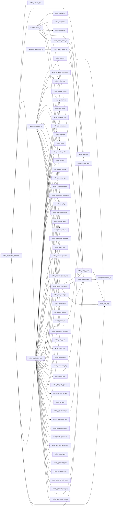

# applications

```mermaid
graph LR
    xxfnd_admin_menu_v --> xxfnd_features
    xxfnd_admin_menu_v --> xxfnd_privilege_pkg
    xxfnd_application_functions --> xxfnd_application_pkg
    xxfnd_application_functions --> xxfnd_applications
    xxfnd_application_functions --> xxfnd_ddl_pkg
    xxfnd_application_functions --> xxfnd_features
    xxfnd_application_functions --> xxfnd_schema_pkg
    xxfnd_application_pkg --> xxfnd_app_menu_entries
    xxfnd_application_pkg --> xxfnd_application_functions
    xxfnd_application_pkg --> xxfnd_applications
    xxfnd_application_pkg --> xxfnd_approval_rule_pkg
    xxfnd_application_pkg --> xxfnd_approval_rule_steps
    xxfnd_application_pkg --> xxfnd_approval_rules
    xxfnd_application_pkg --> xxfnd_approval_types
    xxfnd_application_pkg --> xxfnd_attach_pkg
    xxfnd_application_pkg --> xxfnd_attached_documents
    xxfnd_application_pkg --> xxfnd_attachment_functions
    xxfnd_application_pkg --> xxfnd_contact_sources
    xxfnd_application_pkg --> xxfnd_data_dimensions
    xxfnd_application_pkg --> xxfnd_data_model_pkg
    xxfnd_application_pkg --> xxfnd_data_objects
    xxfnd_application_pkg --> xxfnd_df_flexfields
    xxfnd_application_pkg --> xxfnd_dff_pkg
    xxfnd_application_pkg --> xxfnd_dm_app_scopes
    xxfnd_application_pkg --> xxfnd_dm_table_groups
    xxfnd_application_pkg --> xxfnd_document_categories
    xxfnd_application_pkg --> xxfnd_document_entities
    xxfnd_application_pkg --> xxfnd_error_pkg
    xxfnd_application_pkg --> xxfnd_feature_pages
    xxfnd_application_pkg --> xxfnd_features
    xxfnd_application_pkg --> xxfnd_integration_pkg
    xxfnd_application_pkg --> xxfnd_integration_purposes
    xxfnd_application_pkg --> xxfnd_lookup_pkg
    xxfnd_application_pkg --> xxfnd_lookup_types
    xxfnd_application_pkg --> xxfnd_lookup_values
    xxfnd_application_pkg --> xxfnd_notification_templates
    xxfnd_application_pkg --> xxfnd_notify_pkg
    xxfnd_application_pkg --> xxfnd_notify_rules
    xxfnd_application_pkg --> xxfnd_privilege_pkg
    xxfnd_application_pkg --> xxfnd_privileges
    xxfnd_application_pkg --> xxfnd_retention_policies
    xxfnd_application_pkg --> xxfnd_role_privileges
    xxfnd_application_pkg --> xxfnd_roles
    xxfnd_application_pkg --> xxfnd_setup_type_apps
    xxfnd_application_pkg --> xxfnd_setup_types
    xxfnd_application_pkg --> xxfnd_share_pkg
    xxfnd_application_pkg --> xxfnd_sod_rules
    xxfnd_application_pkg --> xxfnd_storage_config
    xxfnd_application_pkg --> xxfnd_task_settings
    xxfnd_application_pkg --> xxfnd_user_applications
    xxfnd_application_pkg --> xxfnd_user_pkg
    xxfnd_application_pkg --> xxfnd_user_role_tree_v
    xxfnd_application_pkg --> xxfnd_user_roles_v
    xxfnd_application_pkg --> xxfnd_util_pkg
    xxfnd_application_pkg --> xxfnd_value_sets
    xxfnd_application_pkg --> xxfnd_vpd_pkg
    xxfnd_application_pkg --> xxfnd_workflow_pkg
    xxfnd_application_pkg --> xxfnd_workflow_processes
    xxfnd_application_pkg --> xxhr_organizations
    xxfnd_applications --> xxfnd_applications_s
    xxfnd_applications_id --> xxfnd_applications
    xxfnd_modules_v --> xxfnd_admin_menu_v
    xxfnd_modules_v --> xxfnd_applications
    xxfnd_modules_v --> xxfnd_feature_pages
    xxfnd_modules_v --> xxfnd_lookup_values
    xxfnd_modules_v --> xxfnd_servers_v
    xxfnd_modules_v --> xxfnd_user_roles
    xxfnd_modules_v --> xxfnd_workflow_processes
    xxfnd_modules_v --> xxhr_employees
    xxfnd_setup_columns_v --> xxfnd_setup_tables_v
    xxfnd_setup_rows_v --> xxfnd_attachment_functions
    xxfnd_setup_rows_v --> xxfnd_data_objects
    xxfnd_setup_rows_v --> xxfnd_df_flexfields
    xxfnd_setup_rows_v --> xxfnd_document_categories
    xxfnd_setup_rows_v --> xxfnd_document_entities
    xxfnd_setup_rows_v --> xxfnd_integration_purposes
    xxfnd_setup_rows_v --> xxfnd_lookup_types
    xxfnd_setup_rows_v --> xxfnd_notification_templates
    xxfnd_setup_rows_v --> xxfnd_retention_policies
    xxfnd_setup_rows_v --> xxfnd_roles
    xxfnd_setup_rows_v --> xxfnd_servers
    xxfnd_setup_rows_v --> xxfnd_sod_rules
    xxfnd_setup_rows_v --> xxfnd_storage_config
    xxfnd_setup_rows_v --> xxfnd_value_sets
    xxfnd_setup_tables_v --> xxfnd_applications
    xxfnd_setup_type_apps --> xxfnd_applications
    xxfnd_setup_type_apps --> xxfnd_ddl_pkg
    xxfnd_setup_type_apps --> xxfnd_setup_types
    xxfnd_setup_types --> xxfnd_ddl_pkg
    xxfnd_setup_types --> xxfnd_setup_type_apps
    xxfnd_workflow_processes --> xxfnd_applications
    xxfnd_workflow_processes --> xxfnd_ddl_pkg
```
