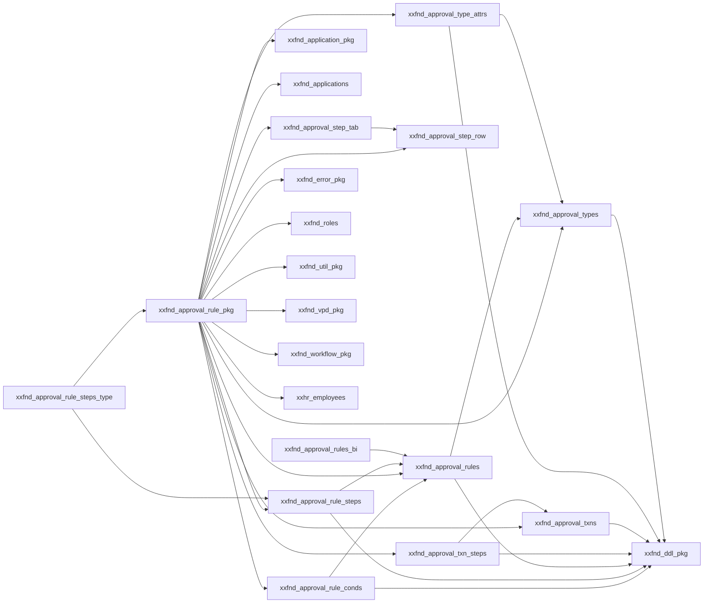

# approval-setup

```mermaid
graph LR
    xxfnd_approval_rule_conds --> xxfnd_approval_rules
    xxfnd_approval_rule_conds --> xxfnd_ddl_pkg
    xxfnd_approval_rule_pkg --> xxfnd_application_pkg
    xxfnd_approval_rule_pkg --> xxfnd_applications
    xxfnd_approval_rule_pkg --> xxfnd_approval_rule_conds
    xxfnd_approval_rule_pkg --> xxfnd_approval_rule_steps
    xxfnd_approval_rule_pkg --> xxfnd_approval_rules
    xxfnd_approval_rule_pkg --> xxfnd_approval_step_row
    xxfnd_approval_rule_pkg --> xxfnd_approval_step_tab
    xxfnd_approval_rule_pkg --> xxfnd_approval_txn_steps
    xxfnd_approval_rule_pkg --> xxfnd_approval_txns
    xxfnd_approval_rule_pkg --> xxfnd_approval_type_attrs
    xxfnd_approval_rule_pkg --> xxfnd_approval_types
    xxfnd_approval_rule_pkg --> xxfnd_error_pkg
    xxfnd_approval_rule_pkg --> xxfnd_roles
    xxfnd_approval_rule_pkg --> xxfnd_util_pkg
    xxfnd_approval_rule_pkg --> xxfnd_vpd_pkg
    xxfnd_approval_rule_pkg --> xxfnd_workflow_pkg
    xxfnd_approval_rule_pkg --> xxhr_employees
    xxfnd_approval_rule_steps --> xxfnd_approval_rules
    xxfnd_approval_rule_steps --> xxfnd_ddl_pkg
    xxfnd_approval_rule_steps_type --> xxfnd_approval_rule_pkg
    xxfnd_approval_rule_steps_type --> xxfnd_approval_rule_steps
    xxfnd_approval_rules --> xxfnd_approval_types
    xxfnd_approval_rules --> xxfnd_ddl_pkg
    xxfnd_approval_rules_bi --> xxfnd_approval_rules
    xxfnd_approval_step_tab --> xxfnd_approval_step_row
    xxfnd_approval_txn_steps --> xxfnd_approval_txns
    xxfnd_approval_txn_steps --> xxfnd_ddl_pkg
    xxfnd_approval_txns --> xxfnd_ddl_pkg
    xxfnd_approval_type_attrs --> xxfnd_approval_types
    xxfnd_approval_type_attrs --> xxfnd_ddl_pkg
    xxfnd_approval_types --> xxfnd_ddl_pkg
```
