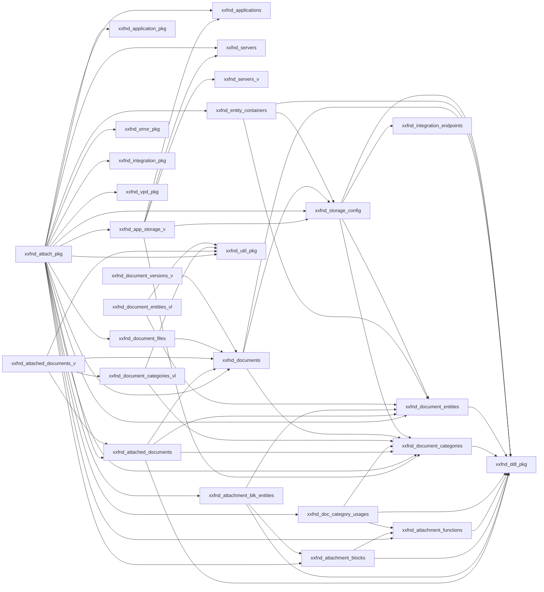

# attachments

```mermaid
graph LR
    xxfnd_app_storage_v --> xxfnd_applications
    xxfnd_app_storage_v --> xxfnd_document_categories
    xxfnd_app_storage_v --> xxfnd_servers
    xxfnd_app_storage_v --> xxfnd_servers_v
    xxfnd_app_storage_v --> xxfnd_storage_config
    xxfnd_attach_pkg --> xxfnd_app_storage_v
    xxfnd_attach_pkg --> xxfnd_application_pkg
    xxfnd_attach_pkg --> xxfnd_applications
    xxfnd_attach_pkg --> xxfnd_attached_documents
    xxfnd_attach_pkg --> xxfnd_attachment_blk_entities
    xxfnd_attach_pkg --> xxfnd_attachment_blocks
    xxfnd_attach_pkg --> xxfnd_attachment_functions
    xxfnd_attach_pkg --> xxfnd_doc_category_usages
    xxfnd_attach_pkg --> xxfnd_document_categories
    xxfnd_attach_pkg --> xxfnd_document_entities
    xxfnd_attach_pkg --> xxfnd_document_files
    xxfnd_attach_pkg --> xxfnd_documents
    xxfnd_attach_pkg --> xxfnd_entity_containers
    xxfnd_attach_pkg --> xxfnd_error_pkg
    xxfnd_attach_pkg --> xxfnd_integration_pkg
    xxfnd_attach_pkg --> xxfnd_servers
    xxfnd_attach_pkg --> xxfnd_storage_config
    xxfnd_attach_pkg --> xxfnd_util_pkg
    xxfnd_attach_pkg --> xxfnd_vpd_pkg
    xxfnd_attached_documents --> xxfnd_ddl_pkg
    xxfnd_attached_documents --> xxfnd_document_categories
    xxfnd_attached_documents --> xxfnd_document_entities
    xxfnd_attached_documents --> xxfnd_documents
    xxfnd_attached_documents_v --> xxfnd_attached_documents
    xxfnd_attached_documents_v --> xxfnd_document_categories_vl
    xxfnd_attached_documents_v --> xxfnd_documents
    xxfnd_attached_documents_v --> xxfnd_util_pkg
    xxfnd_attachment_blk_entities --> xxfnd_attachment_blocks
    xxfnd_attachment_blk_entities --> xxfnd_ddl_pkg
    xxfnd_attachment_blk_entities --> xxfnd_document_entities
    xxfnd_attachment_blocks --> xxfnd_attachment_functions
    xxfnd_attachment_blocks --> xxfnd_ddl_pkg
    xxfnd_attachment_functions --> xxfnd_ddl_pkg
    xxfnd_doc_category_usages --> xxfnd_attachment_functions
    xxfnd_doc_category_usages --> xxfnd_ddl_pkg
    xxfnd_doc_category_usages --> xxfnd_document_categories
    xxfnd_document_categories --> xxfnd_ddl_pkg
    xxfnd_document_categories_vl --> xxfnd_document_categories
    xxfnd_document_categories_vl --> xxfnd_util_pkg
    xxfnd_document_entities --> xxfnd_ddl_pkg
    xxfnd_document_entities_vl --> xxfnd_document_entities
    xxfnd_document_entities_vl --> xxfnd_util_pkg
    xxfnd_document_files --> xxfnd_documents
    xxfnd_document_versions_v --> xxfnd_documents
    xxfnd_documents --> xxfnd_ddl_pkg
    xxfnd_documents --> xxfnd_document_categories
    xxfnd_documents --> xxfnd_storage_config
    xxfnd_entity_containers --> xxfnd_ddl_pkg
    xxfnd_entity_containers --> xxfnd_document_entities
    xxfnd_entity_containers --> xxfnd_storage_config
    xxfnd_storage_config --> xxfnd_ddl_pkg
    xxfnd_storage_config --> xxfnd_document_categories
    xxfnd_storage_config --> xxfnd_document_entities
    xxfnd_storage_config --> xxfnd_integration_endpoints
```
