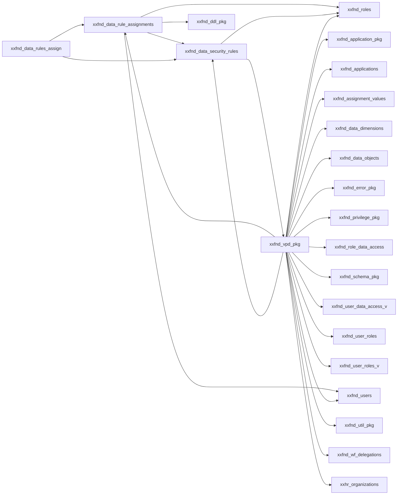

# data-security

```mermaid
graph LR
    xxfnd_data_rule_assignments --> xxfnd_data_security_rules
    xxfnd_data_rule_assignments --> xxfnd_ddl_pkg
    xxfnd_data_rule_assignments --> xxfnd_roles
    xxfnd_data_rule_assignments --> xxfnd_users
    xxfnd_data_rules_assign --> xxfnd_data_rule_assignments
    xxfnd_data_rules_assign --> xxfnd_data_security_rules
    xxfnd_data_security_rules --> xxfnd_roles
    xxfnd_data_security_rules --> xxfnd_vpd_pkg
    xxfnd_vpd_pkg --> xxfnd_application_pkg
    xxfnd_vpd_pkg --> xxfnd_applications
    xxfnd_vpd_pkg --> xxfnd_assignment_values
    xxfnd_vpd_pkg --> xxfnd_data_dimensions
    xxfnd_vpd_pkg --> xxfnd_data_objects
    xxfnd_vpd_pkg --> xxfnd_data_rule_assignments
    xxfnd_vpd_pkg --> xxfnd_data_security_rules
    xxfnd_vpd_pkg --> xxfnd_error_pkg
    xxfnd_vpd_pkg --> xxfnd_privilege_pkg
    xxfnd_vpd_pkg --> xxfnd_role_data_access
    xxfnd_vpd_pkg --> xxfnd_roles
    xxfnd_vpd_pkg --> xxfnd_schema_pkg
    xxfnd_vpd_pkg --> xxfnd_user_data_access_v
    xxfnd_vpd_pkg --> xxfnd_user_roles
    xxfnd_vpd_pkg --> xxfnd_user_roles_v
    xxfnd_vpd_pkg --> xxfnd_users
    xxfnd_vpd_pkg --> xxfnd_util_pkg
    xxfnd_vpd_pkg --> xxfnd_wf_delegations
    xxfnd_vpd_pkg --> xxhr_organizations
```
