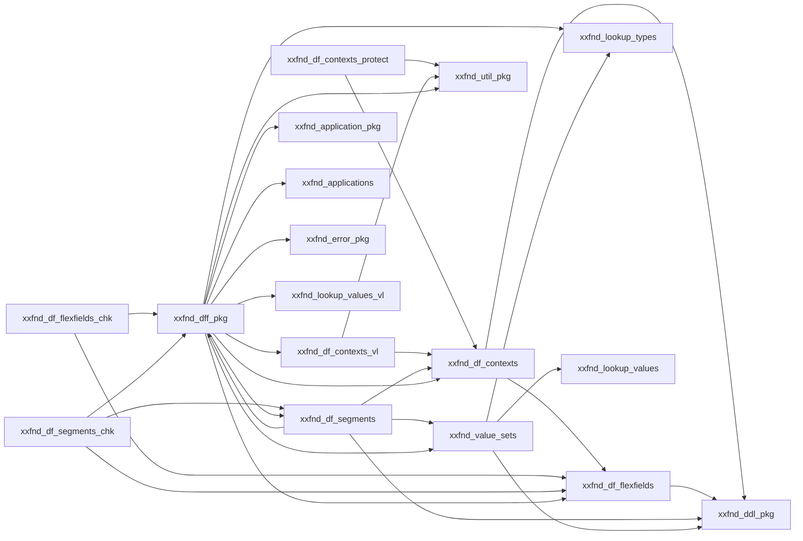

# flexfields

```mermaid
graph LR
    xxfnd_df_contexts --> xxfnd_ddl_pkg
    xxfnd_df_contexts --> xxfnd_df_flexfields
    xxfnd_df_contexts_protect --> xxfnd_df_contexts
    xxfnd_df_contexts_protect --> xxfnd_util_pkg
    xxfnd_df_contexts_vl --> xxfnd_df_contexts
    xxfnd_df_contexts_vl --> xxfnd_util_pkg
    xxfnd_df_flexfields --> xxfnd_ddl_pkg
    xxfnd_df_flexfields_chk --> xxfnd_df_flexfields
    xxfnd_df_flexfields_chk --> xxfnd_dff_pkg
    xxfnd_df_segments --> xxfnd_ddl_pkg
    xxfnd_df_segments --> xxfnd_df_contexts
    xxfnd_df_segments --> xxfnd_dff_pkg
    xxfnd_df_segments --> xxfnd_value_sets
    xxfnd_df_segments_chk --> xxfnd_df_flexfields
    xxfnd_df_segments_chk --> xxfnd_df_segments
    xxfnd_df_segments_chk --> xxfnd_dff_pkg
    xxfnd_dff_pkg --> xxfnd_application_pkg
    xxfnd_dff_pkg --> xxfnd_applications
    xxfnd_dff_pkg --> xxfnd_df_contexts
    xxfnd_dff_pkg --> xxfnd_df_contexts_vl
    xxfnd_dff_pkg --> xxfnd_df_flexfields
    xxfnd_dff_pkg --> xxfnd_df_segments
    xxfnd_dff_pkg --> xxfnd_error_pkg
    xxfnd_dff_pkg --> xxfnd_lookup_types
    xxfnd_dff_pkg --> xxfnd_lookup_values_vl
    xxfnd_dff_pkg --> xxfnd_util_pkg
    xxfnd_dff_pkg --> xxfnd_value_sets
    xxfnd_value_sets --> xxfnd_ddl_pkg
    xxfnd_value_sets --> xxfnd_lookup_types
    xxfnd_value_sets --> xxfnd_lookup_values
```
