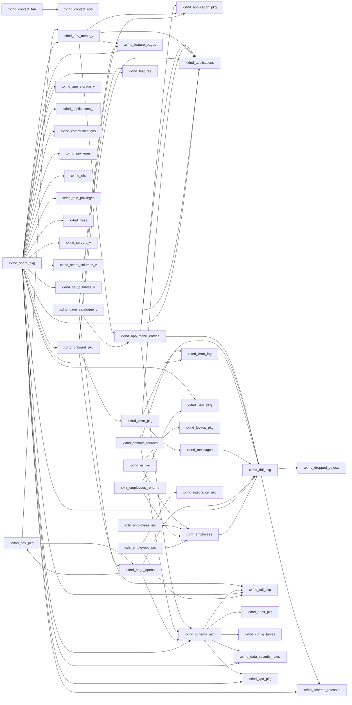

# framework

```mermaid
graph LR
    xxfnd_app_menu_entries --> xxfnd_application_pkg
    xxfnd_app_menu_entries --> xxfnd_applications
    xxfnd_app_menu_entries --> xxfnd_ddl_pkg
    xxfnd_app_menu_entries --> xxfnd_schema_pkg
    xxfnd_contact_sources --> xxfnd_applications
    xxfnd_contact_sources --> xxfnd_ddl_pkg
    xxfnd_contact_sources --> xxfnd_schema_pkg
    xxfnd_contact_tab --> xxfnd_contact_row
    xxfnd_ddl_pkg --> xxfnd_dropped_objects
    xxfnd_ddl_pkg --> xxfnd_schema_releases
    xxfnd_error_log --> xxfnd_ddl_pkg
    xxfnd_error_pkg --> xxfnd_error_log
    xxfnd_error_pkg --> xxfnd_messages
    xxfnd_messages --> xxfnd_ddl_pkg
    xxfnd_nav_menu_v --> xxfnd_app_menu_entries
    xxfnd_nav_menu_v --> xxfnd_application_pkg
    xxfnd_nav_menu_v --> xxfnd_applications
    xxfnd_nav_menu_v --> xxfnd_feature_pages
    xxfnd_nav_pkg --> xxfnd_nav_menu_v
    xxfnd_nav_pkg --> xxfnd_page_opens
    xxfnd_onboard_pkg --> xxfnd_application_pkg
    xxfnd_onboard_pkg --> xxfnd_applications
    xxfnd_onboard_pkg --> xxfnd_error_pkg
    xxfnd_onboard_pkg --> xxfnd_util_pkg
    xxfnd_page_catalogue_v --> xxfnd_app_menu_entries
    xxfnd_page_catalogue_v --> xxfnd_applications
    xxfnd_page_catalogue_v --> xxfnd_feature_pages
    xxfnd_page_catalogue_v --> xxfnd_features
    xxfnd_page_catalogue_v --> xxfnd_page_opens
    xxfnd_page_opens --> xxfnd_ddl_pkg
    xxfnd_page_opens --> xxfnd_nav_pkg
    xxfnd_page_opens --> xxfnd_schema_pkg
    xxfnd_schema_pkg --> xxfnd_audit_pkg
    xxfnd_schema_pkg --> xxfnd_config_tables
    xxfnd_schema_pkg --> xxfnd_data_security_rules
    xxfnd_schema_pkg --> xxfnd_util_pkg
    xxfnd_schema_pkg --> xxfnd_vpd_pkg
    xxfnd_share_pkg --> xxfnd_app_storage_v
    xxfnd_share_pkg --> xxfnd_applications
    xxfnd_share_pkg --> xxfnd_applications_s
    xxfnd_share_pkg --> xxfnd_communications
    xxfnd_share_pkg --> xxfnd_data_security_rules
    xxfnd_share_pkg --> xxfnd_ddl_pkg
    xxfnd_share_pkg --> xxfnd_error_log
    xxfnd_share_pkg --> xxfnd_feature_pages
    xxfnd_share_pkg --> xxfnd_features
    xxfnd_share_pkg --> xxfnd_nav_menu_v
    xxfnd_share_pkg --> xxfnd_onboard_pkg
    xxfnd_share_pkg --> xxfnd_privileges
    xxfnd_share_pkg --> xxfnd_rfis
    xxfnd_share_pkg --> xxfnd_role_privileges
    xxfnd_share_pkg --> xxfnd_roles
    xxfnd_share_pkg --> xxfnd_schema_pkg
    xxfnd_share_pkg --> xxfnd_schema_releases
    xxfnd_share_pkg --> xxfnd_servers_v
    xxfnd_share_pkg --> xxfnd_setup_columns_v
    xxfnd_share_pkg --> xxfnd_setup_tables_v
    xxfnd_share_pkg --> xxfnd_user_pkg
    xxfnd_share_pkg --> xxfnd_util_pkg
    xxfnd_share_pkg --> xxfnd_vpd_pkg
    xxfnd_ui_pkg --> xxfnd_lookup_pkg
    xxfnd_ui_pkg --> xxhr_employees
    xxhr_employees --> xxfnd_ddl_pkg
    xxhr_employees_ins --> xxhr_employees
    xxhr_employees_rename --> xxfnd_user_pkg
    xxhr_employees_rename --> xxhr_employees
    xxhr_employees_src --> xxfnd_integration_pkg
    xxhr_employees_src --> xxfnd_util_pkg
    xxhr_employees_src --> xxhr_employees
```
