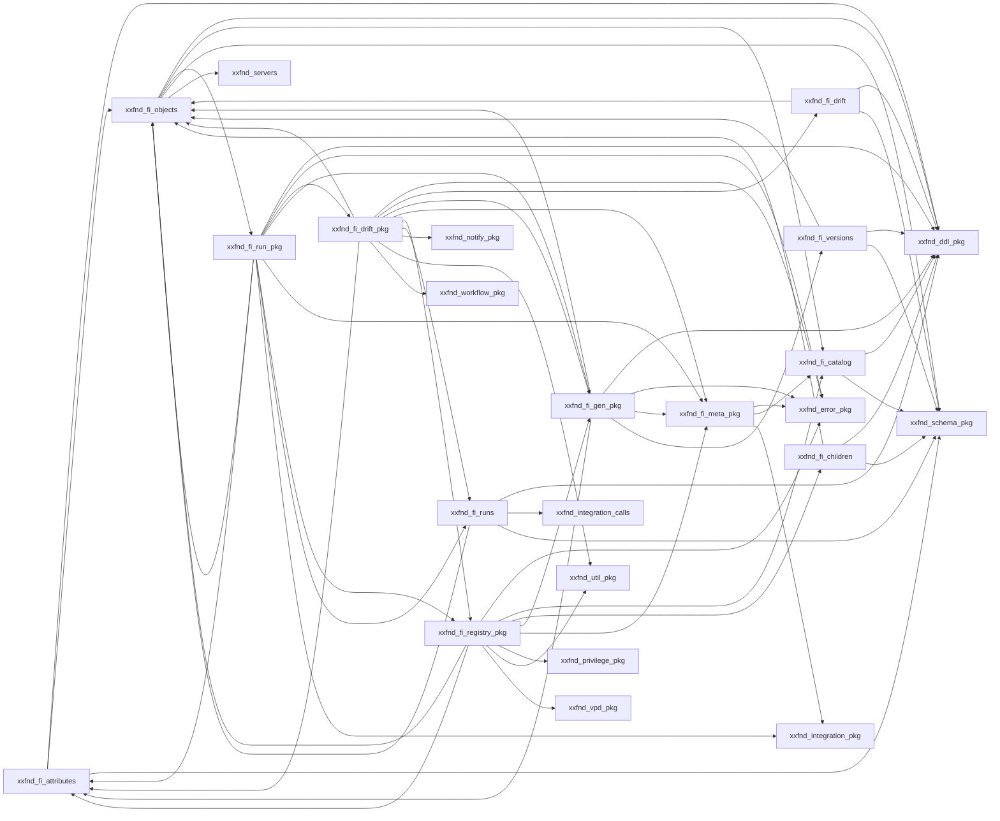

# fusion-objects

```mermaid
graph LR
    xxfnd_fi_attributes --> xxfnd_ddl_pkg
    xxfnd_fi_attributes --> xxfnd_fi_objects
    xxfnd_fi_attributes --> xxfnd_schema_pkg
    xxfnd_fi_catalog --> xxfnd_ddl_pkg
    xxfnd_fi_catalog --> xxfnd_schema_pkg
    xxfnd_fi_children --> xxfnd_ddl_pkg
    xxfnd_fi_children --> xxfnd_fi_objects
    xxfnd_fi_children --> xxfnd_schema_pkg
    xxfnd_fi_drift --> xxfnd_ddl_pkg
    xxfnd_fi_drift --> xxfnd_fi_objects
    xxfnd_fi_drift --> xxfnd_schema_pkg
    xxfnd_fi_drift_pkg --> xxfnd_error_pkg
    xxfnd_fi_drift_pkg --> xxfnd_fi_attributes
    xxfnd_fi_drift_pkg --> xxfnd_fi_drift
    xxfnd_fi_drift_pkg --> xxfnd_fi_gen_pkg
    xxfnd_fi_drift_pkg --> xxfnd_fi_meta_pkg
    xxfnd_fi_drift_pkg --> xxfnd_fi_objects
    xxfnd_fi_drift_pkg --> xxfnd_fi_registry_pkg
    xxfnd_fi_drift_pkg --> xxfnd_fi_runs
    xxfnd_fi_drift_pkg --> xxfnd_notify_pkg
    xxfnd_fi_drift_pkg --> xxfnd_util_pkg
    xxfnd_fi_drift_pkg --> xxfnd_workflow_pkg
    xxfnd_fi_gen_pkg --> xxfnd_ddl_pkg
    xxfnd_fi_gen_pkg --> xxfnd_error_pkg
    xxfnd_fi_gen_pkg --> xxfnd_fi_attributes
    xxfnd_fi_gen_pkg --> xxfnd_fi_meta_pkg
    xxfnd_fi_gen_pkg --> xxfnd_fi_objects
    xxfnd_fi_gen_pkg --> xxfnd_fi_versions
    xxfnd_fi_meta_pkg --> xxfnd_error_pkg
    xxfnd_fi_meta_pkg --> xxfnd_fi_catalog
    xxfnd_fi_meta_pkg --> xxfnd_integration_pkg
    xxfnd_fi_objects --> xxfnd_ddl_pkg
    xxfnd_fi_objects --> xxfnd_fi_catalog
    xxfnd_fi_objects --> xxfnd_fi_run_pkg
    xxfnd_fi_objects --> xxfnd_schema_pkg
    xxfnd_fi_objects --> xxfnd_servers
    xxfnd_fi_registry_pkg --> xxfnd_error_pkg
    xxfnd_fi_registry_pkg --> xxfnd_fi_attributes
    xxfnd_fi_registry_pkg --> xxfnd_fi_catalog
    xxfnd_fi_registry_pkg --> xxfnd_fi_children
    xxfnd_fi_registry_pkg --> xxfnd_fi_gen_pkg
    xxfnd_fi_registry_pkg --> xxfnd_fi_meta_pkg
    xxfnd_fi_registry_pkg --> xxfnd_fi_objects
    xxfnd_fi_registry_pkg --> xxfnd_privilege_pkg
    xxfnd_fi_registry_pkg --> xxfnd_util_pkg
    xxfnd_fi_registry_pkg --> xxfnd_vpd_pkg
    xxfnd_fi_run_pkg --> xxfnd_ddl_pkg
    xxfnd_fi_run_pkg --> xxfnd_error_pkg
    xxfnd_fi_run_pkg --> xxfnd_fi_attributes
    xxfnd_fi_run_pkg --> xxfnd_fi_drift_pkg
    xxfnd_fi_run_pkg --> xxfnd_fi_gen_pkg
    xxfnd_fi_run_pkg --> xxfnd_fi_meta_pkg
    xxfnd_fi_run_pkg --> xxfnd_fi_objects
    xxfnd_fi_run_pkg --> xxfnd_fi_registry_pkg
    xxfnd_fi_run_pkg --> xxfnd_fi_runs
    xxfnd_fi_run_pkg --> xxfnd_integration_pkg
    xxfnd_fi_runs --> xxfnd_ddl_pkg
    xxfnd_fi_runs --> xxfnd_fi_objects
    xxfnd_fi_runs --> xxfnd_integration_calls
    xxfnd_fi_runs --> xxfnd_schema_pkg
    xxfnd_fi_versions --> xxfnd_ddl_pkg
    xxfnd_fi_versions --> xxfnd_fi_objects
    xxfnd_fi_versions --> xxfnd_schema_pkg
```
