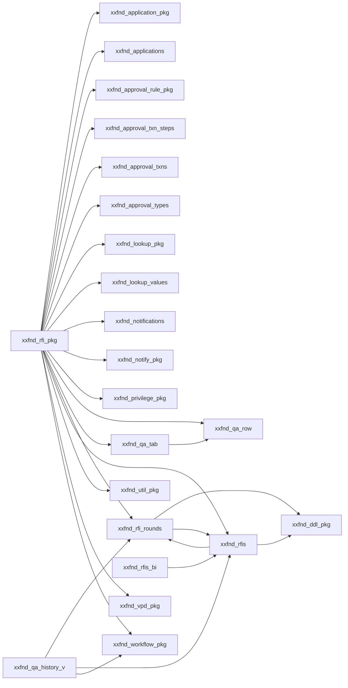

# information-requests

```mermaid
graph LR
    xxfnd_qa_history_v --> xxfnd_rfi_rounds
    xxfnd_qa_history_v --> xxfnd_rfis
    xxfnd_qa_history_v --> xxfnd_workflow_pkg
    xxfnd_qa_tab --> xxfnd_qa_row
    xxfnd_rfi_pkg --> xxfnd_application_pkg
    xxfnd_rfi_pkg --> xxfnd_applications
    xxfnd_rfi_pkg --> xxfnd_approval_rule_pkg
    xxfnd_rfi_pkg --> xxfnd_approval_txn_steps
    xxfnd_rfi_pkg --> xxfnd_approval_txns
    xxfnd_rfi_pkg --> xxfnd_approval_types
    xxfnd_rfi_pkg --> xxfnd_lookup_pkg
    xxfnd_rfi_pkg --> xxfnd_lookup_values
    xxfnd_rfi_pkg --> xxfnd_notifications
    xxfnd_rfi_pkg --> xxfnd_notify_pkg
    xxfnd_rfi_pkg --> xxfnd_privilege_pkg
    xxfnd_rfi_pkg --> xxfnd_qa_row
    xxfnd_rfi_pkg --> xxfnd_qa_tab
    xxfnd_rfi_pkg --> xxfnd_rfi_rounds
    xxfnd_rfi_pkg --> xxfnd_rfis
    xxfnd_rfi_pkg --> xxfnd_util_pkg
    xxfnd_rfi_pkg --> xxfnd_vpd_pkg
    xxfnd_rfi_pkg --> xxfnd_workflow_pkg
    xxfnd_rfi_rounds --> xxfnd_ddl_pkg
    xxfnd_rfi_rounds --> xxfnd_rfis
    xxfnd_rfis --> xxfnd_ddl_pkg
    xxfnd_rfis --> xxfnd_rfi_rounds
    xxfnd_rfis_bi --> xxfnd_rfis
```
