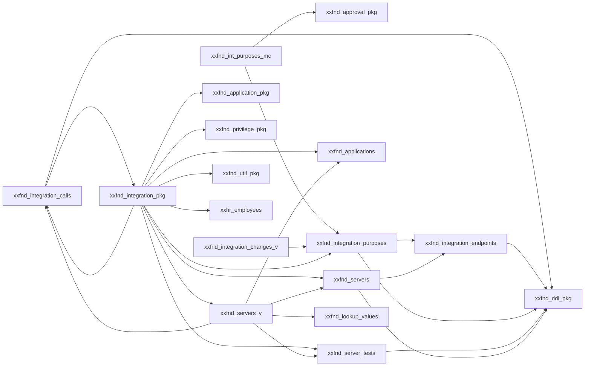

# integrations

```mermaid
graph LR
    xxfnd_int_purposes_mc --> xxfnd_approval_pkg
    xxfnd_int_purposes_mc --> xxfnd_integration_purposes
    xxfnd_integration_calls --> xxfnd_ddl_pkg
    xxfnd_integration_calls --> xxfnd_integration_pkg
    xxfnd_integration_changes_v --> xxfnd_integration_purposes
    xxfnd_integration_endpoints --> xxfnd_ddl_pkg
    xxfnd_integration_pkg --> xxfnd_application_pkg
    xxfnd_integration_pkg --> xxfnd_applications
    xxfnd_integration_pkg --> xxfnd_integration_calls
    xxfnd_integration_pkg --> xxfnd_integration_purposes
    xxfnd_integration_pkg --> xxfnd_privilege_pkg
    xxfnd_integration_pkg --> xxfnd_server_tests
    xxfnd_integration_pkg --> xxfnd_servers
    xxfnd_integration_pkg --> xxfnd_servers_v
    xxfnd_integration_pkg --> xxfnd_util_pkg
    xxfnd_integration_pkg --> xxhr_employees
    xxfnd_integration_purposes --> xxfnd_ddl_pkg
    xxfnd_integration_purposes --> xxfnd_integration_endpoints
    xxfnd_server_tests --> xxfnd_ddl_pkg
    xxfnd_servers --> xxfnd_ddl_pkg
    xxfnd_servers --> xxfnd_integration_endpoints
    xxfnd_servers_v --> xxfnd_applications
    xxfnd_servers_v --> xxfnd_integration_calls
    xxfnd_servers_v --> xxfnd_lookup_values
    xxfnd_servers_v --> xxfnd_server_tests
    xxfnd_servers_v --> xxfnd_servers
```
