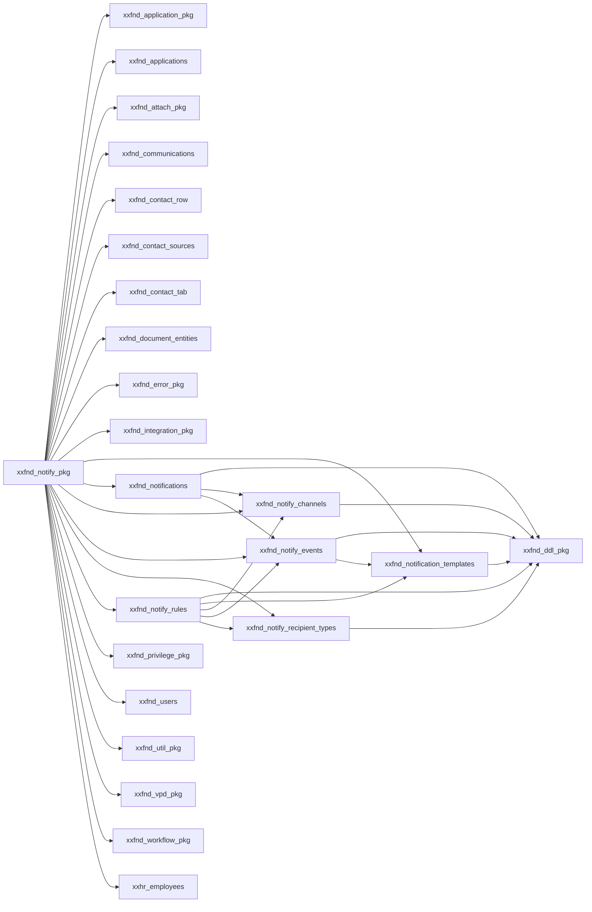

# notifications

```mermaid
graph LR
    xxfnd_notification_templates --> xxfnd_ddl_pkg
    xxfnd_notifications --> xxfnd_ddl_pkg
    xxfnd_notifications --> xxfnd_notify_channels
    xxfnd_notifications --> xxfnd_notify_events
    xxfnd_notify_channels --> xxfnd_ddl_pkg
    xxfnd_notify_events --> xxfnd_ddl_pkg
    xxfnd_notify_events --> xxfnd_notification_templates
    xxfnd_notify_pkg --> xxfnd_application_pkg
    xxfnd_notify_pkg --> xxfnd_applications
    xxfnd_notify_pkg --> xxfnd_attach_pkg
    xxfnd_notify_pkg --> xxfnd_communications
    xxfnd_notify_pkg --> xxfnd_contact_row
    xxfnd_notify_pkg --> xxfnd_contact_sources
    xxfnd_notify_pkg --> xxfnd_contact_tab
    xxfnd_notify_pkg --> xxfnd_document_entities
    xxfnd_notify_pkg --> xxfnd_error_pkg
    xxfnd_notify_pkg --> xxfnd_integration_pkg
    xxfnd_notify_pkg --> xxfnd_notification_templates
    xxfnd_notify_pkg --> xxfnd_notifications
    xxfnd_notify_pkg --> xxfnd_notify_channels
    xxfnd_notify_pkg --> xxfnd_notify_events
    xxfnd_notify_pkg --> xxfnd_notify_recipient_types
    xxfnd_notify_pkg --> xxfnd_notify_rules
    xxfnd_notify_pkg --> xxfnd_privilege_pkg
    xxfnd_notify_pkg --> xxfnd_users
    xxfnd_notify_pkg --> xxfnd_util_pkg
    xxfnd_notify_pkg --> xxfnd_vpd_pkg
    xxfnd_notify_pkg --> xxfnd_workflow_pkg
    xxfnd_notify_pkg --> xxhr_employees
    xxfnd_notify_recipient_types --> xxfnd_ddl_pkg
    xxfnd_notify_rules --> xxfnd_ddl_pkg
    xxfnd_notify_rules --> xxfnd_notification_templates
    xxfnd_notify_rules --> xxfnd_notify_channels
    xxfnd_notify_rules --> xxfnd_notify_events
    xxfnd_notify_rules --> xxfnd_notify_recipient_types
```
