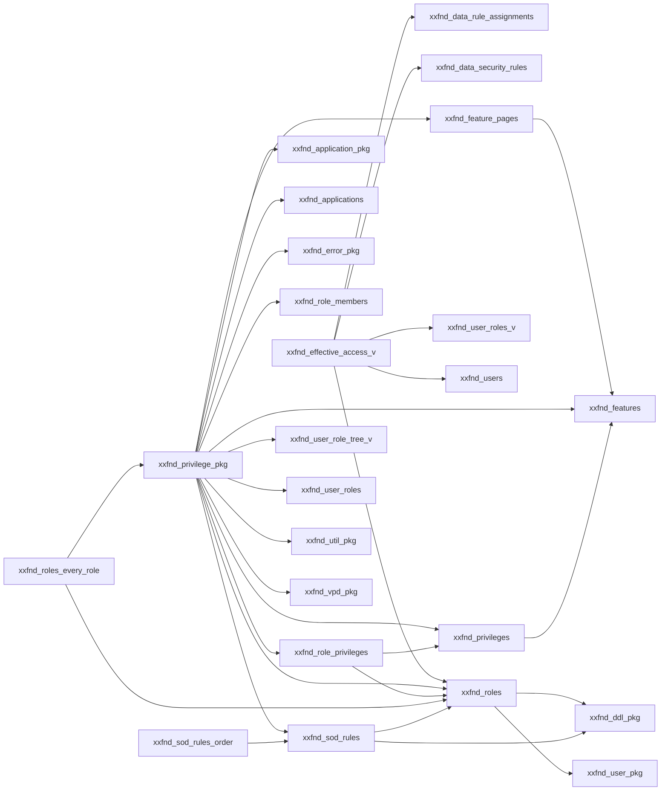

# roles-privileges

```mermaid
graph LR
    xxfnd_effective_access_v --> xxfnd_data_rule_assignments
    xxfnd_effective_access_v --> xxfnd_data_security_rules
    xxfnd_effective_access_v --> xxfnd_roles
    xxfnd_effective_access_v --> xxfnd_user_roles_v
    xxfnd_effective_access_v --> xxfnd_users
    xxfnd_feature_pages --> xxfnd_features
    xxfnd_privilege_pkg --> xxfnd_application_pkg
    xxfnd_privilege_pkg --> xxfnd_applications
    xxfnd_privilege_pkg --> xxfnd_error_pkg
    xxfnd_privilege_pkg --> xxfnd_feature_pages
    xxfnd_privilege_pkg --> xxfnd_features
    xxfnd_privilege_pkg --> xxfnd_privileges
    xxfnd_privilege_pkg --> xxfnd_role_members
    xxfnd_privilege_pkg --> xxfnd_role_privileges
    xxfnd_privilege_pkg --> xxfnd_roles
    xxfnd_privilege_pkg --> xxfnd_sod_rules
    xxfnd_privilege_pkg --> xxfnd_user_role_tree_v
    xxfnd_privilege_pkg --> xxfnd_user_roles
    xxfnd_privilege_pkg --> xxfnd_util_pkg
    xxfnd_privilege_pkg --> xxfnd_vpd_pkg
    xxfnd_privileges --> xxfnd_features
    xxfnd_role_privileges --> xxfnd_privileges
    xxfnd_role_privileges --> xxfnd_roles
    xxfnd_roles --> xxfnd_ddl_pkg
    xxfnd_roles --> xxfnd_user_pkg
    xxfnd_roles_every_role --> xxfnd_privilege_pkg
    xxfnd_roles_every_role --> xxfnd_roles
    xxfnd_sod_rules --> xxfnd_ddl_pkg
    xxfnd_sod_rules --> xxfnd_roles
    xxfnd_sod_rules_order --> xxfnd_sod_rules
```
