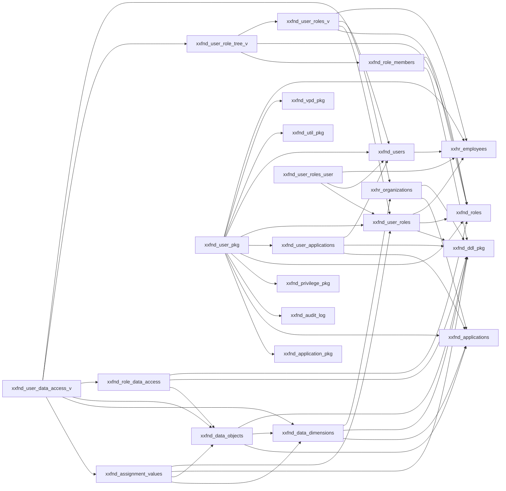

# users-access

```mermaid
graph LR
    xxfnd_assignment_values --> xxfnd_data_dimensions
    xxfnd_assignment_values --> xxfnd_data_objects
    xxfnd_assignment_values --> xxfnd_ddl_pkg
    xxfnd_assignment_values --> xxfnd_user_roles
    xxfnd_data_dimensions --> xxfnd_applications
    xxfnd_data_dimensions --> xxfnd_ddl_pkg
    xxfnd_data_dimensions --> xxhr_organizations
    xxfnd_data_objects --> xxfnd_applications
    xxfnd_data_objects --> xxfnd_data_dimensions
    xxfnd_data_objects --> xxfnd_ddl_pkg
    xxfnd_role_data_access --> xxfnd_data_objects
    xxfnd_role_data_access --> xxfnd_ddl_pkg
    xxfnd_role_data_access --> xxfnd_roles
    xxfnd_role_members --> xxfnd_ddl_pkg
    xxfnd_role_members --> xxfnd_roles
    xxfnd_user_applications --> xxfnd_applications
    xxfnd_user_applications --> xxfnd_ddl_pkg
    xxfnd_user_applications --> xxfnd_users
    xxfnd_user_data_access_v --> xxfnd_assignment_values
    xxfnd_user_data_access_v --> xxfnd_data_dimensions
    xxfnd_user_data_access_v --> xxfnd_data_objects
    xxfnd_user_data_access_v --> xxfnd_role_data_access
    xxfnd_user_data_access_v --> xxfnd_user_role_tree_v
    xxfnd_user_data_access_v --> xxhr_organizations
    xxfnd_user_pkg --> xxfnd_application_pkg
    xxfnd_user_pkg --> xxfnd_applications
    xxfnd_user_pkg --> xxfnd_audit_log
    xxfnd_user_pkg --> xxfnd_privilege_pkg
    xxfnd_user_pkg --> xxfnd_roles
    xxfnd_user_pkg --> xxfnd_user_applications
    xxfnd_user_pkg --> xxfnd_user_roles
    xxfnd_user_pkg --> xxfnd_users
    xxfnd_user_pkg --> xxfnd_util_pkg
    xxfnd_user_pkg --> xxfnd_vpd_pkg
    xxfnd_user_pkg --> xxhr_employees
    xxfnd_user_role_tree_v --> xxfnd_role_members
    xxfnd_user_role_tree_v --> xxfnd_roles
    xxfnd_user_role_tree_v --> xxfnd_user_roles_v
    xxfnd_user_roles --> xxfnd_ddl_pkg
    xxfnd_user_roles --> xxfnd_roles
    xxfnd_user_roles --> xxhr_employees
    xxfnd_user_roles_user --> xxfnd_user_roles
    xxfnd_user_roles_user --> xxfnd_users
    xxfnd_user_roles_user --> xxhr_employees
    xxfnd_user_roles_v --> xxfnd_roles
    xxfnd_user_roles_v --> xxfnd_user_roles
    xxfnd_user_roles_v --> xxfnd_users
    xxfnd_user_roles_v --> xxhr_employees
    xxfnd_users --> xxhr_employees
    xxhr_organizations --> xxfnd_applications
    xxhr_organizations --> xxfnd_ddl_pkg
```
