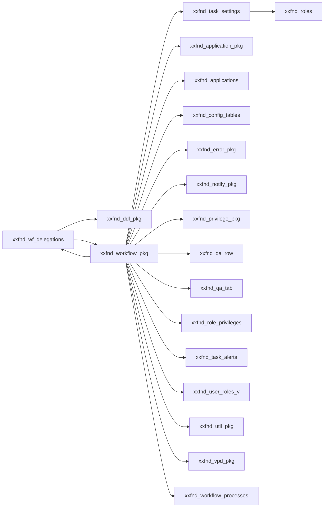

# workflow-setup

```mermaid
graph LR
    xxfnd_task_settings --> xxfnd_roles
    xxfnd_wf_delegations --> xxfnd_ddl_pkg
    xxfnd_wf_delegations --> xxfnd_workflow_pkg
    xxfnd_workflow_pkg --> xxfnd_application_pkg
    xxfnd_workflow_pkg --> xxfnd_applications
    xxfnd_workflow_pkg --> xxfnd_config_tables
    xxfnd_workflow_pkg --> xxfnd_error_pkg
    xxfnd_workflow_pkg --> xxfnd_notify_pkg
    xxfnd_workflow_pkg --> xxfnd_privilege_pkg
    xxfnd_workflow_pkg --> xxfnd_qa_row
    xxfnd_workflow_pkg --> xxfnd_qa_tab
    xxfnd_workflow_pkg --> xxfnd_role_privileges
    xxfnd_workflow_pkg --> xxfnd_task_alerts
    xxfnd_workflow_pkg --> xxfnd_task_settings
    xxfnd_workflow_pkg --> xxfnd_user_roles_v
    xxfnd_workflow_pkg --> xxfnd_util_pkg
    xxfnd_workflow_pkg --> xxfnd_vpd_pkg
    xxfnd_workflow_pkg --> xxfnd_wf_delegations
    xxfnd_workflow_pkg --> xxfnd_workflow_processes
```
