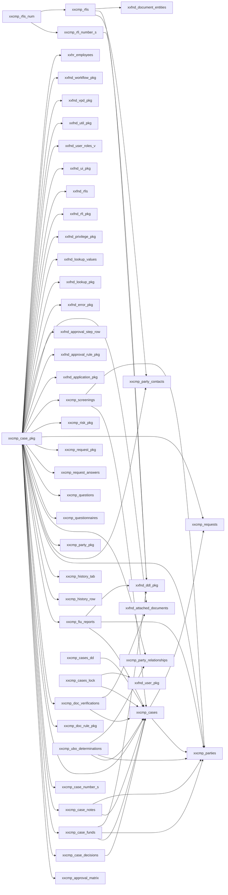

# cases

```mermaid
graph LR
    xxcmp_case_decisions --> xxcmp_cases
    xxcmp_case_funds --> xxcmp_cases
    xxcmp_case_funds --> xxcmp_parties
    xxcmp_case_funds --> xxfnd_ddl_pkg
    xxcmp_case_notes --> xxcmp_cases
    xxcmp_case_notes --> xxcmp_parties
    xxcmp_case_pkg --> xxcmp_approval_matrix
    xxcmp_case_pkg --> xxcmp_case_decisions
    xxcmp_case_pkg --> xxcmp_case_funds
    xxcmp_case_pkg --> xxcmp_case_notes
    xxcmp_case_pkg --> xxcmp_case_number_s
    xxcmp_case_pkg --> xxcmp_cases
    xxcmp_case_pkg --> xxcmp_doc_rule_pkg
    xxcmp_case_pkg --> xxcmp_doc_verifications
    xxcmp_case_pkg --> xxcmp_fiu_reports
    xxcmp_case_pkg --> xxcmp_history_row
    xxcmp_case_pkg --> xxcmp_history_tab
    xxcmp_case_pkg --> xxcmp_parties
    xxcmp_case_pkg --> xxcmp_party_contacts
    xxcmp_case_pkg --> xxcmp_party_pkg
    xxcmp_case_pkg --> xxcmp_party_relationships
    xxcmp_case_pkg --> xxcmp_questionnaires
    xxcmp_case_pkg --> xxcmp_questions
    xxcmp_case_pkg --> xxcmp_request_answers
    xxcmp_case_pkg --> xxcmp_request_pkg
    xxcmp_case_pkg --> xxcmp_requests
    xxcmp_case_pkg --> xxcmp_risk_pkg
    xxcmp_case_pkg --> xxcmp_screenings
    xxcmp_case_pkg --> xxfnd_application_pkg
    xxcmp_case_pkg --> xxfnd_approval_rule_pkg
    xxcmp_case_pkg --> xxfnd_approval_step_row
    xxcmp_case_pkg --> xxfnd_attached_documents
    xxcmp_case_pkg --> xxfnd_error_pkg
    xxcmp_case_pkg --> xxfnd_lookup_pkg
    xxcmp_case_pkg --> xxfnd_lookup_values
    xxcmp_case_pkg --> xxfnd_privilege_pkg
    xxcmp_case_pkg --> xxfnd_rfi_pkg
    xxcmp_case_pkg --> xxfnd_rfis
    xxcmp_case_pkg --> xxfnd_ui_pkg
    xxcmp_case_pkg --> xxfnd_user_roles_v
    xxcmp_case_pkg --> xxfnd_util_pkg
    xxcmp_case_pkg --> xxfnd_vpd_pkg
    xxcmp_case_pkg --> xxfnd_workflow_pkg
    xxcmp_case_pkg --> xxhr_employees
    xxcmp_cases --> xxcmp_parties
    xxcmp_cases --> xxcmp_requests
    xxcmp_cases_dd --> xxcmp_cases
    xxcmp_cases_lock --> xxcmp_cases
    xxcmp_cases_lock --> xxfnd_user_pkg
    xxcmp_doc_verifications --> xxcmp_cases
    xxcmp_doc_verifications --> xxfnd_attached_documents
    xxcmp_fiu_reports --> xxcmp_cases
    xxcmp_fiu_reports --> xxcmp_parties
    xxcmp_fiu_reports --> xxfnd_ddl_pkg
    xxcmp_rfi_number_s --> xxfnd_ddl_pkg
    xxcmp_rfis --> xxcmp_party_contacts
    xxcmp_rfis --> xxfnd_ddl_pkg
    xxcmp_rfis --> xxfnd_document_entities
    xxcmp_rfis_num --> xxcmp_rfi_number_s
    xxcmp_rfis_num --> xxcmp_rfis
    xxcmp_screenings --> xxcmp_cases
    xxcmp_screenings --> xxcmp_parties
    xxcmp_ubo_determinations --> xxcmp_cases
    xxcmp_ubo_determinations --> xxcmp_parties
    xxcmp_ubo_determinations --> xxcmp_party_relationships
```
