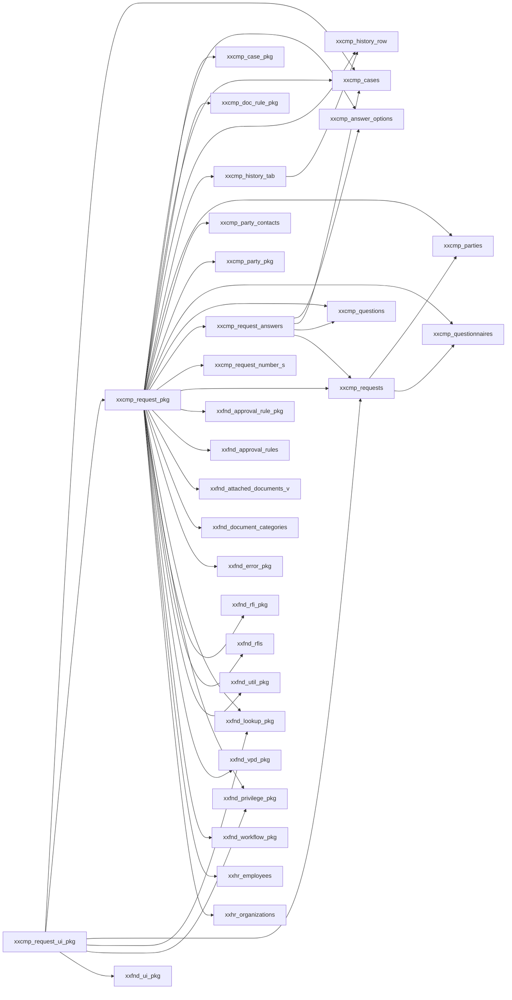

# kyc-requests

```mermaid
graph LR
    xxcmp_history_tab --> xxcmp_history_row
    xxcmp_request_answers --> xxcmp_answer_options
    xxcmp_request_answers --> xxcmp_cases
    xxcmp_request_answers --> xxcmp_questions
    xxcmp_request_answers --> xxcmp_requests
    xxcmp_request_pkg --> xxcmp_answer_options
    xxcmp_request_pkg --> xxcmp_case_pkg
    xxcmp_request_pkg --> xxcmp_cases
    xxcmp_request_pkg --> xxcmp_doc_rule_pkg
    xxcmp_request_pkg --> xxcmp_history_row
    xxcmp_request_pkg --> xxcmp_history_tab
    xxcmp_request_pkg --> xxcmp_parties
    xxcmp_request_pkg --> xxcmp_party_contacts
    xxcmp_request_pkg --> xxcmp_party_pkg
    xxcmp_request_pkg --> xxcmp_questionnaires
    xxcmp_request_pkg --> xxcmp_questions
    xxcmp_request_pkg --> xxcmp_request_answers
    xxcmp_request_pkg --> xxcmp_request_number_s
    xxcmp_request_pkg --> xxcmp_requests
    xxcmp_request_pkg --> xxfnd_approval_rule_pkg
    xxcmp_request_pkg --> xxfnd_approval_rules
    xxcmp_request_pkg --> xxfnd_attached_documents_v
    xxcmp_request_pkg --> xxfnd_document_categories
    xxcmp_request_pkg --> xxfnd_error_pkg
    xxcmp_request_pkg --> xxfnd_lookup_pkg
    xxcmp_request_pkg --> xxfnd_privilege_pkg
    xxcmp_request_pkg --> xxfnd_rfi_pkg
    xxcmp_request_pkg --> xxfnd_rfis
    xxcmp_request_pkg --> xxfnd_util_pkg
    xxcmp_request_pkg --> xxfnd_vpd_pkg
    xxcmp_request_pkg --> xxfnd_workflow_pkg
    xxcmp_request_pkg --> xxhr_employees
    xxcmp_request_pkg --> xxhr_organizations
    xxcmp_request_ui_pkg --> xxcmp_cases
    xxcmp_request_ui_pkg --> xxcmp_request_pkg
    xxcmp_request_ui_pkg --> xxcmp_requests
    xxcmp_request_ui_pkg --> xxfnd_lookup_pkg
    xxcmp_request_ui_pkg --> xxfnd_privilege_pkg
    xxcmp_request_ui_pkg --> xxfnd_ui_pkg
    xxcmp_requests --> xxcmp_parties
    xxcmp_requests --> xxcmp_questionnaires
```
