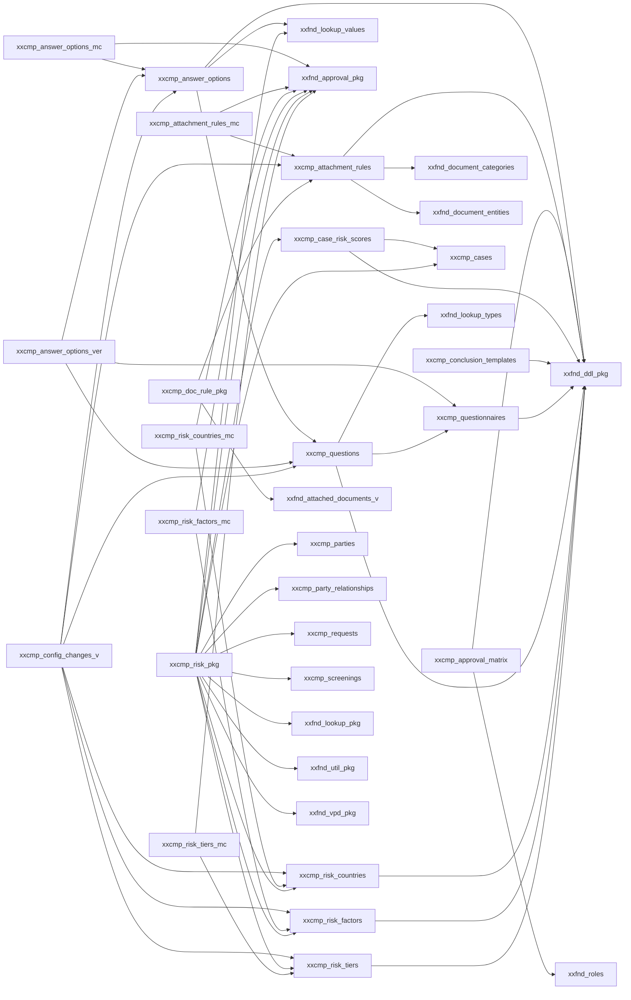

# kyc-rules

```mermaid
graph LR
    xxcmp_answer_options --> xxcmp_questions
    xxcmp_answer_options --> xxfnd_ddl_pkg
    xxcmp_answer_options --> xxfnd_lookup_values
    xxcmp_answer_options_mc --> xxcmp_answer_options
    xxcmp_answer_options_mc --> xxfnd_approval_pkg
    xxcmp_answer_options_ver --> xxcmp_answer_options
    xxcmp_answer_options_ver --> xxcmp_questionnaires
    xxcmp_answer_options_ver --> xxcmp_questions
    xxcmp_approval_matrix --> xxfnd_ddl_pkg
    xxcmp_approval_matrix --> xxfnd_roles
    xxcmp_attachment_rules --> xxfnd_ddl_pkg
    xxcmp_attachment_rules --> xxfnd_document_categories
    xxcmp_attachment_rules --> xxfnd_document_entities
    xxcmp_attachment_rules_mc --> xxcmp_attachment_rules
    xxcmp_attachment_rules_mc --> xxfnd_approval_pkg
    xxcmp_case_risk_scores --> xxcmp_cases
    xxcmp_case_risk_scores --> xxfnd_ddl_pkg
    xxcmp_conclusion_templates --> xxfnd_ddl_pkg
    xxcmp_config_changes_v --> xxcmp_answer_options
    xxcmp_config_changes_v --> xxcmp_attachment_rules
    xxcmp_config_changes_v --> xxcmp_questions
    xxcmp_config_changes_v --> xxcmp_risk_countries
    xxcmp_config_changes_v --> xxcmp_risk_factors
    xxcmp_config_changes_v --> xxcmp_risk_tiers
    xxcmp_doc_rule_pkg --> xxcmp_attachment_rules
    xxcmp_doc_rule_pkg --> xxfnd_attached_documents_v
    xxcmp_questionnaires --> xxfnd_ddl_pkg
    xxcmp_questions --> xxcmp_questionnaires
    xxcmp_questions --> xxfnd_ddl_pkg
    xxcmp_questions --> xxfnd_lookup_types
    xxcmp_risk_countries --> xxfnd_ddl_pkg
    xxcmp_risk_countries_mc --> xxcmp_risk_countries
    xxcmp_risk_countries_mc --> xxfnd_approval_pkg
    xxcmp_risk_factors --> xxfnd_ddl_pkg
    xxcmp_risk_factors_mc --> xxcmp_risk_factors
    xxcmp_risk_factors_mc --> xxfnd_approval_pkg
    xxcmp_risk_pkg --> xxcmp_case_risk_scores
    xxcmp_risk_pkg --> xxcmp_cases
    xxcmp_risk_pkg --> xxcmp_parties
    xxcmp_risk_pkg --> xxcmp_party_relationships
    xxcmp_risk_pkg --> xxcmp_requests
    xxcmp_risk_pkg --> xxcmp_risk_countries
    xxcmp_risk_pkg --> xxcmp_risk_factors
    xxcmp_risk_pkg --> xxcmp_risk_tiers
    xxcmp_risk_pkg --> xxcmp_screenings
    xxcmp_risk_pkg --> xxfnd_approval_pkg
    xxcmp_risk_pkg --> xxfnd_lookup_pkg
    xxcmp_risk_pkg --> xxfnd_lookup_values
    xxcmp_risk_pkg --> xxfnd_util_pkg
    xxcmp_risk_pkg --> xxfnd_vpd_pkg
    xxcmp_risk_tiers --> xxfnd_ddl_pkg
    xxcmp_risk_tiers_mc --> xxcmp_risk_tiers
    xxcmp_risk_tiers_mc --> xxfnd_approval_pkg
```
