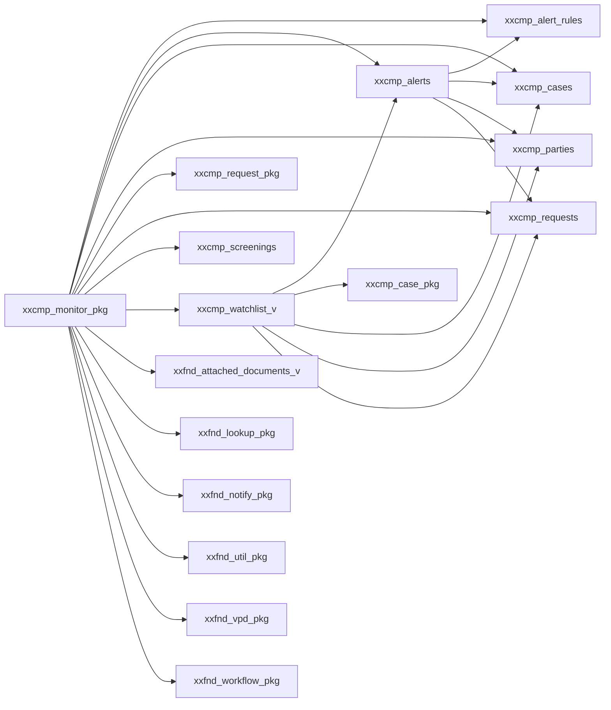

# monitoring

```mermaid
graph LR
    xxcmp_alerts --> xxcmp_alert_rules
    xxcmp_alerts --> xxcmp_cases
    xxcmp_alerts --> xxcmp_parties
    xxcmp_alerts --> xxcmp_requests
    xxcmp_monitor_pkg --> xxcmp_alert_rules
    xxcmp_monitor_pkg --> xxcmp_alerts
    xxcmp_monitor_pkg --> xxcmp_cases
    xxcmp_monitor_pkg --> xxcmp_parties
    xxcmp_monitor_pkg --> xxcmp_request_pkg
    xxcmp_monitor_pkg --> xxcmp_requests
    xxcmp_monitor_pkg --> xxcmp_screenings
    xxcmp_monitor_pkg --> xxcmp_watchlist_v
    xxcmp_monitor_pkg --> xxfnd_attached_documents_v
    xxcmp_monitor_pkg --> xxfnd_lookup_pkg
    xxcmp_monitor_pkg --> xxfnd_notify_pkg
    xxcmp_monitor_pkg --> xxfnd_util_pkg
    xxcmp_monitor_pkg --> xxfnd_vpd_pkg
    xxcmp_monitor_pkg --> xxfnd_workflow_pkg
    xxcmp_watchlist_v --> xxcmp_alerts
    xxcmp_watchlist_v --> xxcmp_case_pkg
    xxcmp_watchlist_v --> xxcmp_cases
    xxcmp_watchlist_v --> xxcmp_parties
    xxcmp_watchlist_v --> xxcmp_requests
```
