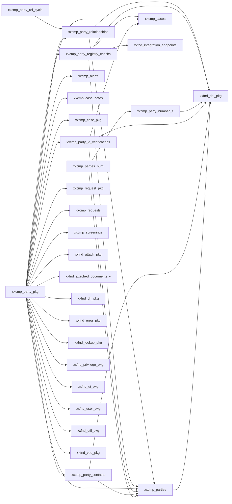

# parties

```mermaid
graph LR
    xxcmp_parties --> xxfnd_ddl_pkg
    xxcmp_parties_num --> xxcmp_parties
    xxcmp_parties_num --> xxcmp_party_number_s
    xxcmp_party_contacts --> xxcmp_parties
    xxcmp_party_contacts --> xxfnd_ddl_pkg
    xxcmp_party_id_verifications --> xxcmp_cases
    xxcmp_party_id_verifications --> xxcmp_parties
    xxcmp_party_id_verifications --> xxfnd_ddl_pkg
    xxcmp_party_number_s --> xxfnd_ddl_pkg
    xxcmp_party_pkg --> xxcmp_alerts
    xxcmp_party_pkg --> xxcmp_case_notes
    xxcmp_party_pkg --> xxcmp_case_pkg
    xxcmp_party_pkg --> xxcmp_cases
    xxcmp_party_pkg --> xxcmp_parties
    xxcmp_party_pkg --> xxcmp_party_contacts
    xxcmp_party_pkg --> xxcmp_party_id_verifications
    xxcmp_party_pkg --> xxcmp_party_registry_checks
    xxcmp_party_pkg --> xxcmp_party_relationships
    xxcmp_party_pkg --> xxcmp_request_pkg
    xxcmp_party_pkg --> xxcmp_requests
    xxcmp_party_pkg --> xxcmp_screenings
    xxcmp_party_pkg --> xxfnd_attach_pkg
    xxcmp_party_pkg --> xxfnd_attached_documents_v
    xxcmp_party_pkg --> xxfnd_dff_pkg
    xxcmp_party_pkg --> xxfnd_error_pkg
    xxcmp_party_pkg --> xxfnd_lookup_pkg
    xxcmp_party_pkg --> xxfnd_privilege_pkg
    xxcmp_party_pkg --> xxfnd_ui_pkg
    xxcmp_party_pkg --> xxfnd_user_pkg
    xxcmp_party_pkg --> xxfnd_util_pkg
    xxcmp_party_pkg --> xxfnd_vpd_pkg
    xxcmp_party_registry_checks --> xxcmp_cases
    xxcmp_party_registry_checks --> xxcmp_parties
    xxcmp_party_registry_checks --> xxfnd_ddl_pkg
    xxcmp_party_registry_checks --> xxfnd_integration_endpoints
    xxcmp_party_rel_cycle --> xxcmp_party_relationships
    xxcmp_party_relationships --> xxcmp_parties
    xxcmp_party_relationships --> xxfnd_ddl_pkg
```
